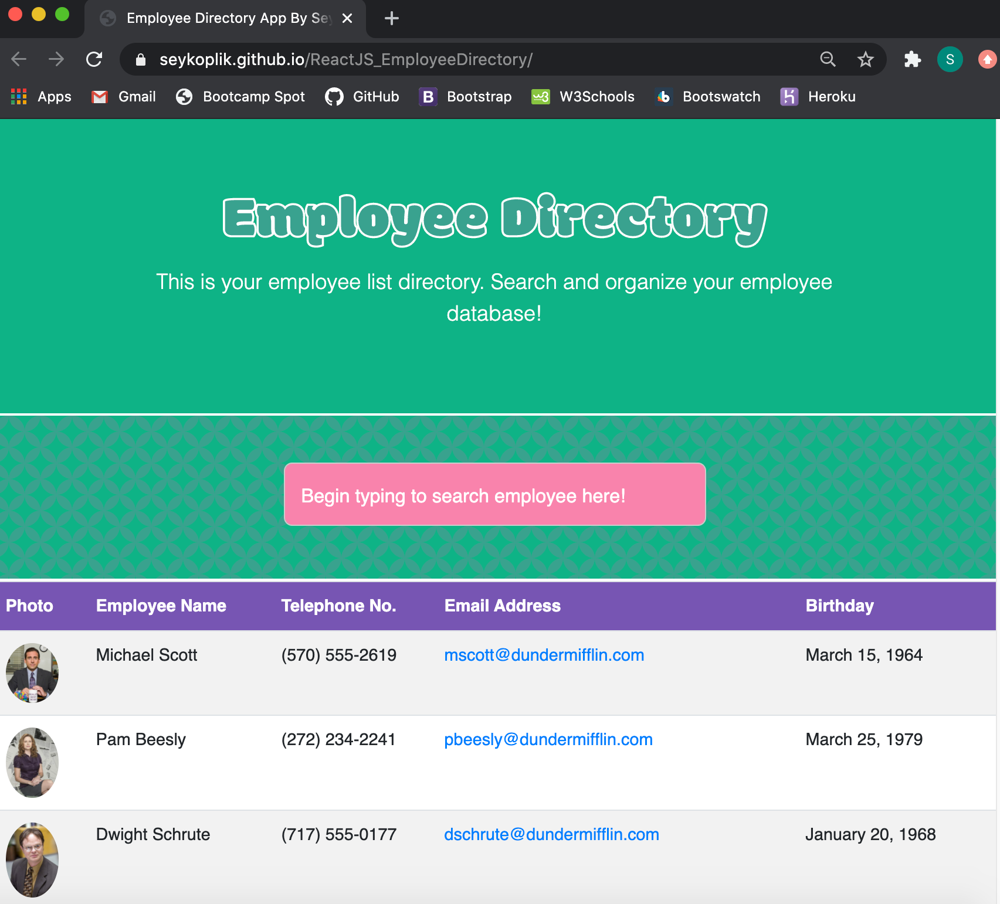

# ReactJS_EmployeeDirectory

[](https://opensource.org/licenses/MIT)

## Description
Employee Directory created with React using components to break up the application's user interface, manage component states, and respond to user events.

Allows a user to view entire directory when page loads and then sort through the criterias available and render a result dynamically while typing in the input box a certain search query.

The use of components and setting states is primarily used to be able to make changes happen as the user interacts with the page and .map() and .filter() functions are used to loop around the results of the query as requested.

## Screenshort Previews




## Installation
This app was created using Reactjs
Enter the following command in the terminal to initiate a react app titled "employeedirectory"
```shell
npx create-react-app employeedirectory
```

After the react app folder is created, install the node modules and start to explore app
```shell
npm install 
npm start
```

To deploy finished app to github pages, install gh-pages to app then run a deploy
```shell
npm install --save gh-pages
npm run deploy
```

Once deployed into GitHub Pages then click the link provided in the links section below.

## Usage
* User is able to sort through employee names alphabetically
* User is able to sort through employee phone numbers by area code
* User is able to sort through employee email alphabetically
* User is able to sort through employee birthdays by exact dates
* User can write in the input box to render a list of employees close to matching query 

## Attributes
- Reactjs
- Bootstrap
- Fontawesome
- Googlefonts
- Wikipedia for The Office resources

## License
MIT

## Links
[Deployed Github Pages](https://seykoplik.github.io/ReactJS_EmployeeDirectory/)

----
Copyright &copy; 2020 Seychelle Koplik